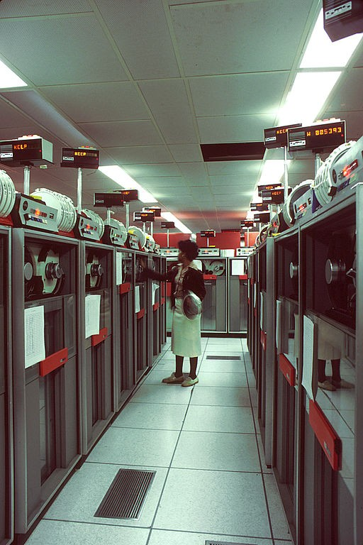
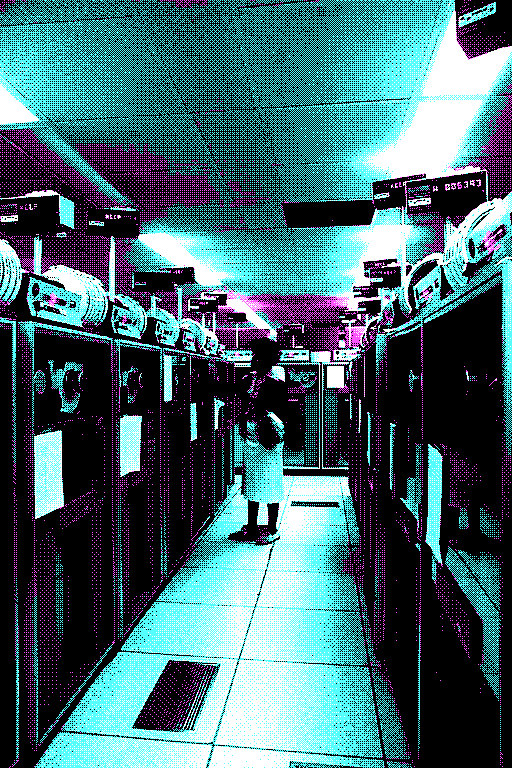
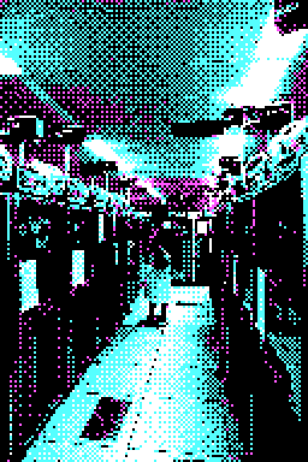
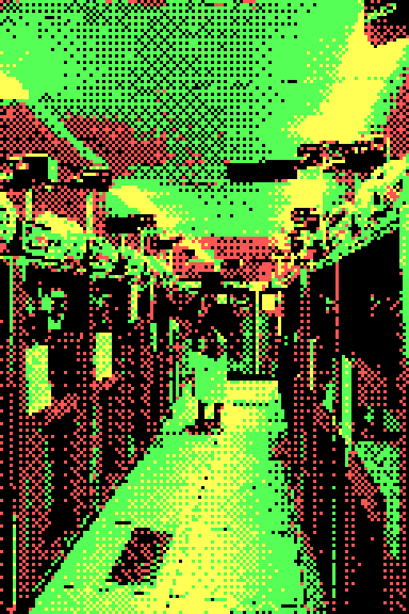
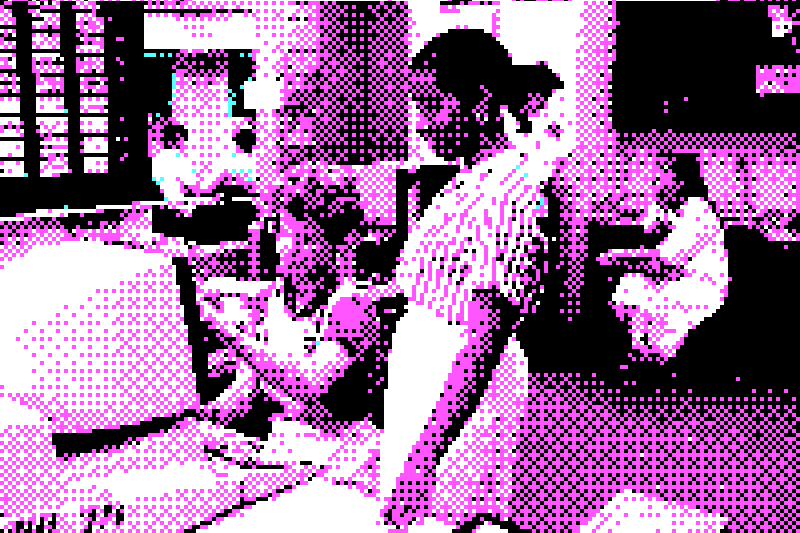
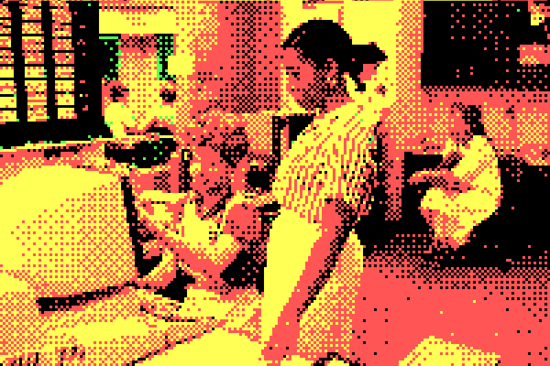

# obs-cga-filter

An [OBS Studio](https://obsproject.com) video filter that dithers any source to a 4-color CGA palette using ordered (Bayer) dithering.

## Demo

### Computer Laboratory (Pixel Size 1 — full resolution dithering)

| Original | Palette 1 Hi — Cyan/Magenta/White | Palette 0 Hi — Green/Red/Yellow |
|:---:|:---:|:---:|
|  |  |  |

### Computer Laboratory (Pixel Size 4 — chunky blocks)

| Original | Palette 1 Hi — Cyan/Magenta/White | Palette 0 Hi — Green/Red/Yellow |
|:---:|:---:|:---:|
|  |  |  |

### Medical Facility (Pixel Size 1 — full resolution dithering)

| Original | Palette 1 Hi — Cyan/Magenta/White | Palette 0 Hi — Green/Red/Yellow |
|:---:|:---:|:---:|
|  |  |  |

### Medical Facility (Pixel Size 4 — chunky blocks)

| Original | Palette 1 Hi — Cyan/Magenta/White | Palette 0 Hi — Green/Red/Yellow |
|:---:|:---:|:---:|
|  |  |  |

---

## Features

- All four classic CGA 4-color palette modes
- Adjustable **Pixel Size** slider — scale down to chunky CGA-resolution blocks or keep full resolution with pure color quantization
- 4×4 Bayer ordered dithering for smooth gradients within the 4-color constraint
- Runs entirely on the GPU as an OBS effect shader — zero CPU overhead

## Palettes

| # | Name | Colors |
|---|------|--------|
| 0 | Palette 1, Hi | Black / Light Cyan `#55FFFF` / Light Magenta `#FF55FF` / White `#FFFFFF` |
| 1 | Palette 1, Lo | Black / Cyan `#00AAAA` / Magenta `#AA00AA` / Light Gray `#AAAAAA` |
| 2 | Palette 0, Hi | Black / Light Green `#55FF55` / Light Red `#FF5555` / Yellow `#FFFF55` |
| 3 | Palette 0, Lo | Black / Green `#00AA00` / Red `#AA0000` / Brown `#AA5500` |

## Requirements

- [OBS Studio](https://obsproject.com) 28 or later
- [Docker](https://docs.docker.com/engine/install/) (for building)

## Building & Installing

```bash
git clone https://github.com/iso88592/obs-cga-filter.git
cd obs-cga-filter
./build.sh
```

The script builds inside Docker and installs the plugin to:

```
~/.config/obs-studio/plugins/obs-cga-filter/
```

Restart OBS after installing.

### Compatibility

The provided `build.sh` compiles against **Ubuntu 22.04 LTS** (glibc 2.35). The resulting binary loads on any glibc-based Linux distribution with a compatible OBS installation:

| Distribution | Minimum version |
|---|---|
| Ubuntu | 22.04 |
| Debian | 12 |
| Fedora | 36 |
| Arch Linux | Rolling (always compatible) |

## Usage

1. In OBS, right-click any source → **Filters**
2. Click **+** → **Video Effects** → **CGA Dither**
3. In the filter properties:
   - **Palette** — choose one of the four CGA palette modes
   - **Pixel Size** — `1` = full source resolution, higher values create larger pixel blocks. A value of `6` approximates the classic CGA 320×200 look on a 1080p source.

## Platform Support

| Platform | Status |
|---|---|
| Linux | Supported |
| Windows | Planned |

## Images used

* Photo on <a href="https://photostockeditor.com/image/1980s-medical-facility-12055">Photostockeditor</a>
* <a href="https://commons.wikimedia.org/wiki/File:Computer_laboratory.jpg">Linda Bartlett (Photographer)</a>, Public domain, via Wikimedia Commons


## License

[MIT](LICENSE)
